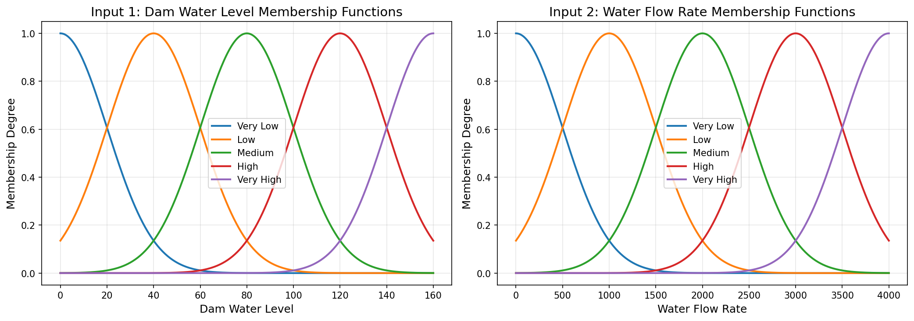
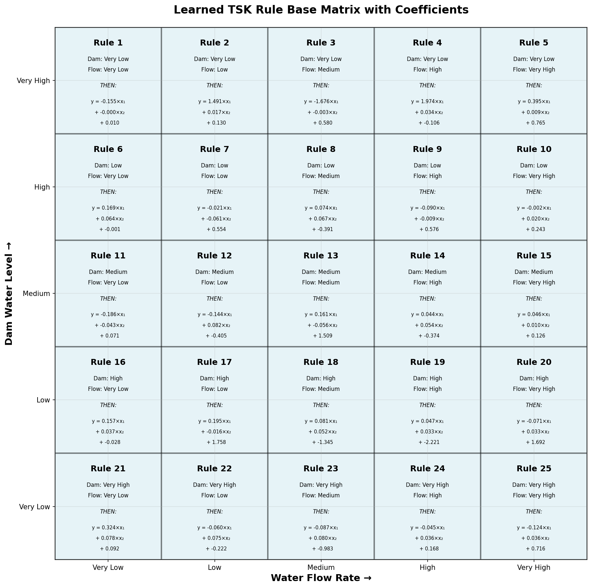
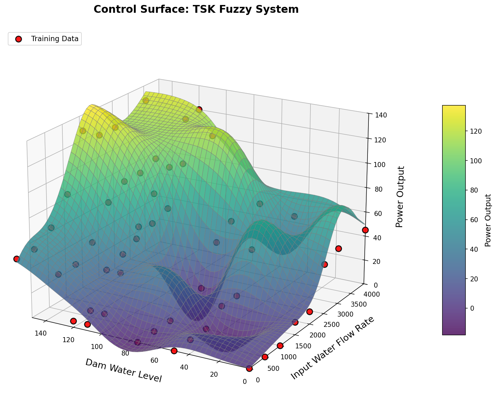

# TSK Fuzzy System with Gradient Descent

A first-order Takagi-Sugeno-Kang (TSK) Fuzzy Inference System built entirely from scratch in Python, trained via gradient descent on manually extracted hydroelectric power plant data. No fuzzy libraries. No optimization frameworks. Pure NumPy.

Developed as part of graduate research in soft computing at the University of Cincinnati AI BIO Lab under Dr. Kelly Cohen.

---

## The Problem

Given two inputs — dam water level (0–160) and water flow rate (0–4000) — predict the power output of a hydroelectric system. The training data was manually extracted from a 3D reference graph, producing 56 data points across key operating conditions.

The system is explicitly non-linear: when dam water level is at maximum and flow rate is very high, the powerhouse must be bypassed to protect equipment — dropping power output to zero despite maximum inputs. This non-monotonic behavior makes the problem unsuitable for simple regression and a natural fit for fuzzy logic.

The challenge: fit a smooth, interpretable fuzzy surface to sparse, manually extracted data using a first-order TSK system whose rule consequents are learned entirely through gradient descent — no genetic algorithm, no library tuning.

---

## Results

| Metric | Value |
|--------|-------|
| Final MSE | 304.93 |
| Final RMSE | 17.46 |
| Final MAE | 13.70 |
| Training epochs | 2000 |
| Rules | 25 (5×5) |
| Parameters learned | 75 (p, q, r per rule) |

**Membership functions:**



**Learned rule base:**



**Control surface vs training data:**



---

## How It Works

```
56 manually extracted data points
(dam_level, flow_rate, power)
   │
   ▼
Fuzzification
   ├── 5 Gaussian MFs for dam water level (0–160)
   └── 5 Gaussian MFs for water flow rate (0–4000)
   │
   ▼
Rule firing
   └── 25 rules (5×5), firing strength = product T-norm
   │
   ▼
First-order TSK defuzzification
   └── Each rule output: y = p×dam + q×flow + r
       Weighted average across all 25 rules
   │
   ▼
Gradient descent training (2000 epochs, lr=0.001)
   ├── Forward pass → MSE loss
   ├── Backprop through defuzzification layer
   └── Gradient clipping for stability
   │
   ▼
Learned rule base with 75 parameters
+ control surface visualization
```

---

## System Design

**Membership functions — Gaussian**

μ(x) = exp(-0.5 × ((x - c) / σ)²)

5 evenly-spaced Gaussian MFs per input with 50% overlap. Linguistic labels: Very Low, Low, Medium, High, Very High. Centers initialized at equal intervals across the input range; sigma set to half the inter-center spacing.

**Rule base — First-order TSK**

Each of the 25 rules has a linear consequent:

```
IF dam is [label] AND flow is [label]
THEN power = p × dam_level + q × flow_rate + r
```

This is first-order TSK — the rule output is a linear function of the inputs, not a constant. This gives the system significantly more expressive power than zeroth-order TSK and allows it to capture local linear trends in each fuzzy region.

**Gradient descent training**

The 75 parameters (p, q, r for each of 25 rules) are initialized randomly and trained via gradient descent with analytical gradients computed through the TSK defuzzification formula. Gradients are clipped to [-10, 10] to prevent exploding gradients on the small dataset.

**Data extraction**

Training data was manually extracted from a 3D reference graph at key operating points — dam levels of 0, 50, 75, 110, 120, 130, and 160, each crossed with flow rates of 0, 500, 1000, 1500, 2000, 2500, 3000, and 4000. A sanity check confirms no values exceed the expected power range of 0–120 MW.

---

## Quickstart

**Clone**
```bash
git clone https://github.com/JetHayes/tsk-fuzzy-system-gradient-descent.git
cd tsk-fuzzy-system-gradient-descent
```

**Install**
```bash
pip install numpy matplotlib
```

**Run**
```bash
python tsk_fuzzy_system.py
```

Expected output:
```
Epoch 500/2000, Loss: xx.xxxx
Epoch 1000/2000, Loss: xx.xxxx
Epoch 1500/2000, Loss: xx.xxxx
Epoch 2000/2000, Loss: xx.xxxx

Training Complete!
Final MSE:  304.9270
Final RMSE: 17.4622
Final MAE:  13.7038
```

Three plots are saved to `results/`:
- `membership_functions.png` — Gaussian MFs for both inputs
- `rule_base_matrix.png` — all 25 rules with learned coefficients
- `control_surface.png` — 3D control surface with training data overlaid

---

## Requirements

```
numpy
matplotlib
```

No fuzzy libraries. No optimization frameworks.

---

## Lessons Learned

Manually extracting training data from a 3D graph is tedious and introduces estimation error — reading off power values from a small printed image at specific dam level and flow rate combinations is inherently imprecise. In a real-world scenario the data would come directly from sensors, eliminating this source of error entirely.

56 data points was enough to capture the general shape of the surface but not enough to reproduce the flat bypass region accurately. The reference surface has a distinctive plateau where power drops to zero at high dam level and very high flow rate — this non-monotonic region requires dense data coverage to learn correctly. More data points, particularly in that region, would significantly improve the fit.

Evenly-spaced membership functions are not always optimal. For a surface with highly non-linear behavior in specific regions, adaptive MF placement — concentrating more MFs where the surface changes rapidly — would give better coverage with the same number of rules.

The computational elegance of TSK with gradient descent contrasts sharply with manually writing Mamdani rules. Rather than hand-crafting rule consequents, gradient descent finds the optimal linear coefficients automatically — keeping the focus on the system architecture rather than the minutiae of individual rules.

---

## Scaling Challenges

Scaling this system to 16 inputs with 5 membership functions each produces 5^16 = 152,587,890,625 rules — over 152 billion. This alone makes the naive approach completely intractable.

First-order TSK adds further complexity: each rule would have 16 input coefficients plus a constant (p₁, p₂, ... p₁₆, r), meaning 17 parameters per rule. At 152 billion rules the parameter space is astronomical.

Interpretability — the primary advantage of fuzzy logic over black-box models — collapses entirely at this scale. No human can reason about 152 billion rules.

Practical approaches for high-dimensional fuzzy systems include rule pruning (removing rules with negligible firing strength), hierarchical fuzzy systems (chaining smaller FIS modules), and dimensionality reduction before fuzzification. The tradeoff is always between accuracy and the explainability that makes fuzzy logic valuable in the first place.

---

## Key Design Decisions

**Why first-order TSK over zeroth-order?**
First-order TSK uses linear rule outputs (p×x₁ + q×x₂ + r) rather than constants. This allows each rule to capture the local slope of the power surface within its fuzzy region — important for a physical system where power output has different sensitivity to dam level vs flow rate depending on operating conditions.

**Why gradient descent over a GA?**
With only 75 parameters and a smooth, differentiable loss function, gradient descent is the right tool. A GA would work but is computationally wasteful when analytical gradients are available. This contrasts directly with the GA-FIS project where the non-differentiable structure of the chromosome made gradient methods impractical.

**Why manual data extraction?**
The training data came from a 3D reference graph with no accompanying numerical table. Manually reading off values at key operating points and verifying them with a sanity check is a practical data engineering skill — the alternative would have been to skip the problem entirely.

---

## Comparison to GA-FIS

This project and the [GA-FIS project](https://github.com/YOUR_USERNAME/ga-fuzzy-inference-system) both implement TSK fuzzy systems from scratch, but with fundamentally different training approaches:

| | TSK + Gradient Descent | GA-FIS |
|--|------------------------|--------|
| Training method | Gradient descent | Genetic algorithm |
| Rule consequents | First-order (linear) | Zeroth-order (constant) |
| Dataset size | 56 points | 1280 points |
| Search space | Continuous, differentiable | Continuous, non-differentiable |
| Best use case | Small datasets, smooth surfaces | Large search spaces, complex structure |

---

## License

MIT License. See `LICENSE` for details.

---

## Author

**John Cavanaugh**
PhD Candidate, Aerospace Engineering
University of Cincinnati — AI BIO Lab
Advisor: Dr. Kelly Cohen

[LinkedIn](https://www.linkedin.com/in/privacy-evangelist/) · [Email](johnthecavanaugh@gmail.com)
